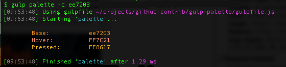

# gulp-palette


## Description
Provided a base HEX color (e.g. 23deb5), generates colors for hover and pressed states.

## Installation

```
npm install
```

## Usage

```
gulp palette -c HEX_CODE
```




